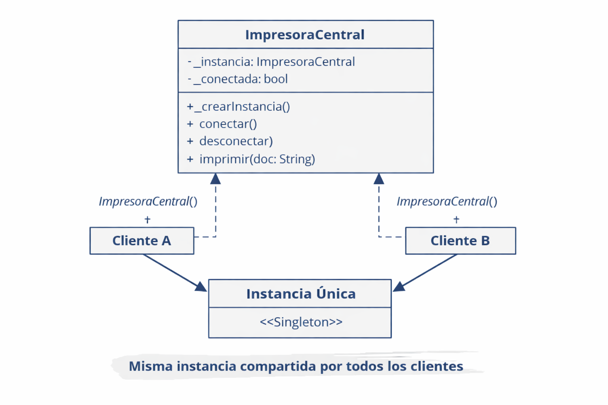

# Patron Singelton Dart

🔹 Qué es: Es un patrón de diseño que asegura que solo exista una única instancia de una clase en toda la aplicación.

🔹 Cómo funciona:

Se crea una instancia privada y estática dentro de la clase.

El constructor se hace privado para que nadie pueda crear nuevas instancias.

Un factory devuelve siempre la misma instancia.

🔹 Consecuencia:

Si usas impresora1 y impresora2, en realidad son el mismo objeto.

Cambiar el estado en uno afecta al otro, porque ambos apuntan al mismo espacio en memoria.

🔹 Cuándo usarlo:

Cuando necesitas un recurso compartido y único: impresora central, conexión a base de datos, logger, configuración global.

🔹 Cuándo no usarlo:

Si quieres procesos paralelos independientes con estados distintos, ahí no sirve Singleton. En Dart usarías instancias normales o Isolates.

## ejemplo2 
en este caso el ServidorCorreo es el recurso único (el servidor real), y las “instancias” que tú creas con var servidor1 = ServidorCorreo(); y var servidor2 = ServidorCorreo(); no son objetos distintos, sino referencias diferentes al mismo servidor.

🔑 Qué significa esto en la práctica:

El servidor es único: solo hay uno en toda la aplicación (gracias al patrón Singleton).

Las referencias (servidor1, servidor2) son como “usuarios” o “clientes” que acceden al mismo servidor.

Si uno conecta o desconecta, el estado cambia para todos, porque comparten la misma instancia.

Así puedes hacer consultas o acciones distintas desde diferentes partes del programa, pero todas se ejecutan sobre el mismo servidor central.

👉 Piensa en ello como una central de correos:

Solo existe un servidor real.

Tú puedes tener varias “ventanas” abiertas hacia ese servidor (las referencias).

No importa desde qué ventana envíes el correo, siempre pasa por el mismo servidor.