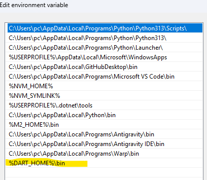
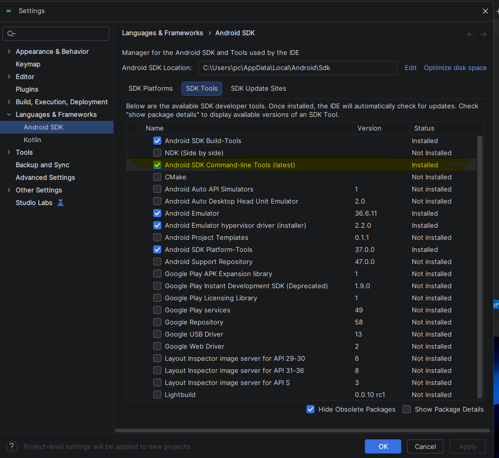
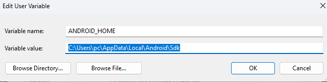
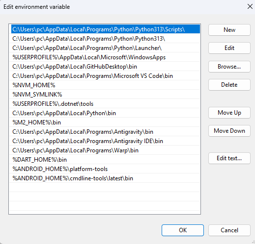
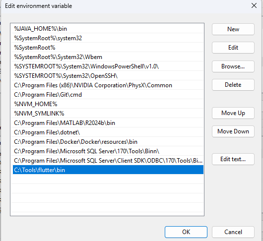
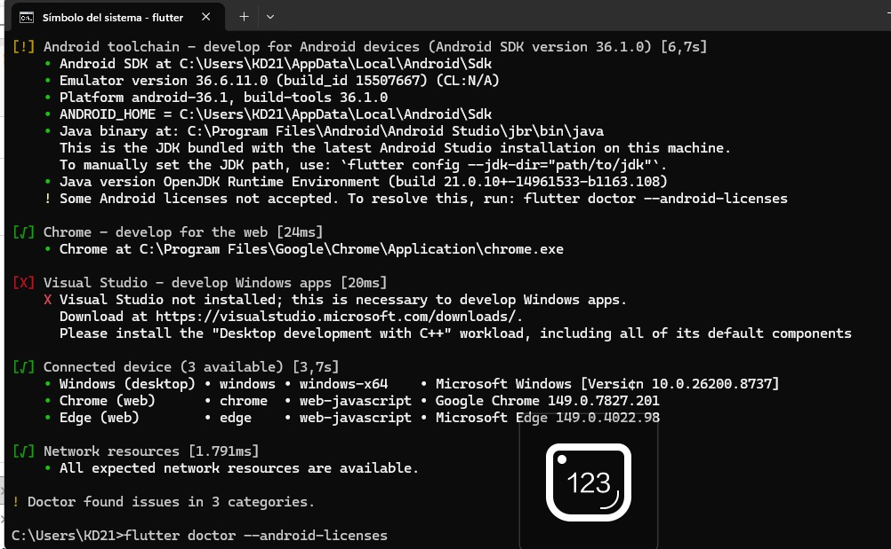
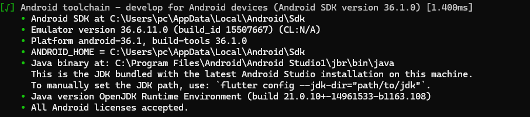

## Manual de instalacion
 
### ! no es necesario si usas flutter (lo del path de dart , solo sirve para codificar desde VSCode)
```link de dart
https://dart.dev/get-dart/archive
```

variable de sistema


en el path del usuario




## ANDROID STUDIO

https://developer.android.com/studio?hl=es-419

#### descargar en sdk tools que no viene por defecto



### variables del sistema

### dentro del path


### comprobar con 
```powershell
sdkmanager --list
```

aceptar todas las licencias con "y"
```
PS C:\Users\pc> sdkmanager --list
Java version 17 or higher is required.
To override this check set SKIP_JDK_VERSION_CHECK
PS C:\Users\pc> flutter doctor --android-licenses
[=======================================] 100% Computing updates...
6 of 7 SDK package licenses not accepted.
Review licenses that have not been accepted (y/N)? y

1/6: License android-googletv-license:
---------------------------------------
Terms and Conditions

This is the Google TV Add-on for the Android Software Development Kit License Agreement.
```

## Flutter

### OPCION MANUAL
https://docs.flutter.dev/install/manual

## flutter en el path


### comprobacion 
```powershell
PS C:\Users\pc> flutter doctor -v
```
ejecutar todo comando que recomiende

dar si a todo y esperar que, solo necesitamos que lo de android este bien

