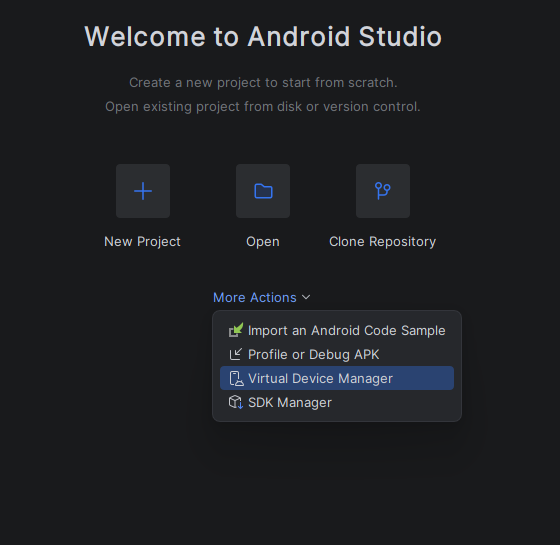
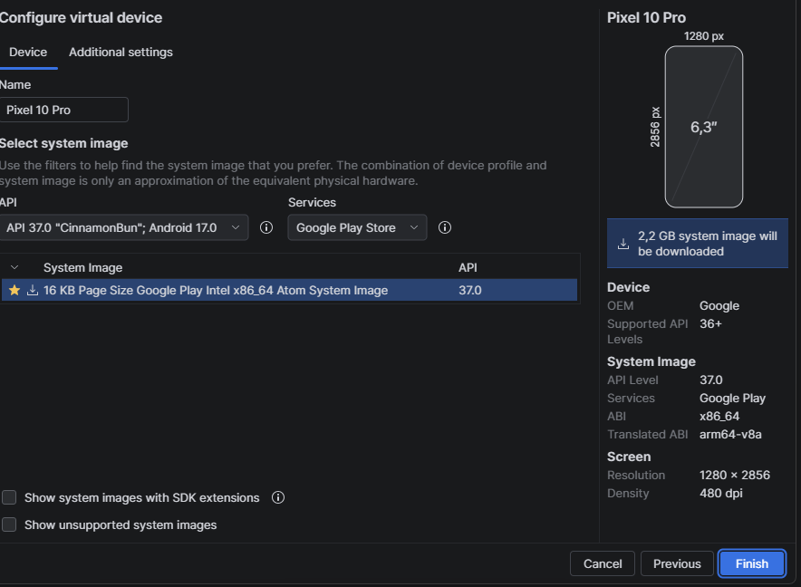
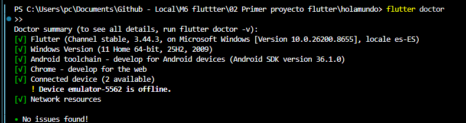
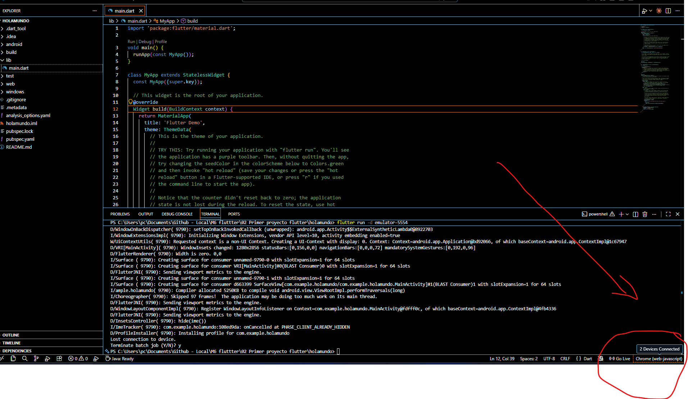

# Android Studio

## Android Studio virtual device


## descargar la 2da mas nueva 


## con `Ctrl + P` crea una aplicacion 
dejar seleccionado unicamente el texto 


asegurarse de 


## en emulador adroid
para correr en el emulador
```
flutter run -d emulator-5554
```

## en en web

