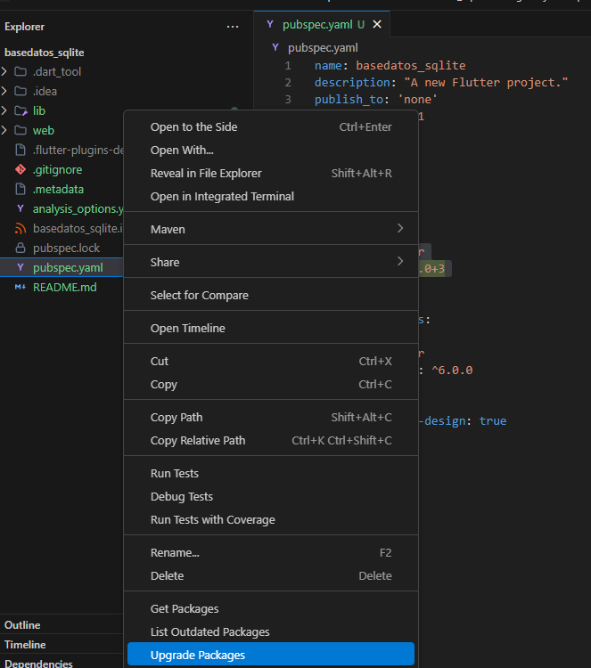

sqlite
```
dependencies:
  flutter:
    sdk: flutter
  sqflite: ^2.0.0+3
  path: ^1.8.0
```

actualizar paketes



Database Helper

```dart
import 'package:basedatos_sqlite/entities/Product.dart';
import 'package:sqflite/sqflite.dart';
import 'package:path/path.dart';

class DatabaseHelper {
  static final DatabaseHelper instance = DatabaseHelper._init();
  static Database? _database;
  DatabaseHelper._init();

  Future<Database> get database async {
    if (_database != null) return _database!;
    _database = await _initDB('products.db');
    return _database!;
  }

  Future<Database> _initDB(String filePath) async {
    final dbPath = await getDatabasesPath();
    final path = join(dbPath, filePath);

    return await openDatabase(path, version: 1, onCreate: _createDB);
  }

  Future _createDB(Database db, int version) async {
    await db.execute('''
      CREATE TABLE products (
        id INTEGER PRIMARY KEY AUTOINCREMENT,
        name TEXT,
        price REAL,
        description TEXT
      )
      ''');
  }

  Future<Product> createProduct(Product product) async {
    final db = await instance.database;
    final id = await db.insert('products', product.toMap());
    print("se inserto el producto ${product.toMap()} al parecer");
    return product.copyWith(id: id);
  }

  Future<Product> getProduct(int id) async {
    final db = await instance.database;
    final result = await db.query('products', where: 'id = ?', whereArgs: [id]);
    if (result.isNotEmpty) {
      print('se encontro el producto ${Product.fromMap(result.first).toMap()}');
      return Product.fromMap(result.first);
    }
    throw Exception('Product not found');
  }

  Future<List<Product>> getProducts() async {
    final db = await instance.database;
    final result = await db.query('products');
    return Product.fromList(result);
  }

  Future<Product> updateProduct(Product product) async {
    final db = await instance.database;
    await db.update(
      'products',
      product.toMap(),
      where: 'id = ?',
      whereArgs: [product.id],
    );
    print('se actualizo el producto ${product.toMap()} al parecer');
    return product; // devolvemos el mismo objeto
  }

Future<bool> deleteProduct(int id) async {
  final db = await instance.database;
  final count = await db.delete('products', where: 'id = ?', whereArgs: [id]);

  if (count > 0) {
    print('Se eliminó el producto con id $id');
    return true;
  } else {
    print('No se encontró producto con id $id');
    return false;
  }
}

}


```


Actualizar dependencias para el test y probar la conexion

```yaml
dependencies:
  flutter:
    sdk: flutter
  sqflite: ^2.0.0+3
  sqflite_common_ffi: ^2.3.1
  path: ^1.8.0

dev_dependencies:
  flutter_test:
    sdk: flutter
  flutter_lints: ^6.0.0
  test: ^1.19.5
```

estucturar y nombrar carpeta test


test ejemplo:
```dart
import 'package:sqflite_common_ffi/sqflite_ffi.dart';
import 'package:flutter_test/flutter_test.dart';
import 'package:basedatos_sqlite/databaHelper.dart';
import 'package:basedatos_sqlite/entities/Product.dart';

void main() {
  group('DatabaseHelper', () {
    final dbHelper = DatabaseHelper.instance;

    setUpAll(() {
      // Inicializa una sola vez antes de todos los tests
      sqfliteFfiInit();
      databaseFactory = databaseFactoryFfi;
    });

    tearDown(() async {
      // Limpia la tabla después de cada test
      final db = await dbHelper.database;
      await db.delete('products');
    });

    test('createProduct', () async {
      final product = Product(name: 'Test', price: 10.0, description: 'Test');
      final createdProduct = await dbHelper.createProduct(product);
      expect(createdProduct.id, isNotNull);
    });

    test('getProduct', () async {
      final product = Product(name: 'Test', price: 10.0, description: 'Test');
      final createdProduct = await dbHelper.createProduct(product);
      final retrievedProduct = await dbHelper.getProduct(createdProduct.id!);
      expect(retrievedProduct.id, createdProduct.id);
    });

    test('getProducts', () async {
      final product = Product(name: 'Test', price: 10.0, description: 'Test');
      await dbHelper.createProduct(product);
      final products = await dbHelper.getProducts();
      expect(products.length, 1);
    });

    test('updateProduct', () async {
      final product = Product(name: 'Test', price: 10.0, description: 'Test');
      final createdProduct = await dbHelper.createProduct(product);
      final updatedProduct = await dbHelper.updateProduct(
        createdProduct.copyWith(price: 20.0),
      );
      expect(updatedProduct.price, 20.0);
    });

    test('deleteProduct', () async {
      final product = Product(name: 'Test', price: 10.0, description: 'Test');
      final createdProduct = await dbHelper.createProduct(product);
      final deleted = await dbHelper.deleteProduct(createdProduct.id!);
      expect(deleted, true);
    });
  });
}

```

comando para correr los test:
```comandpromt
PS C:\Users\pc\Documents\Github - Local\M6 fluttter\07 baseDatos\basedatos_sqlite> flutter test
>>
00:01 +0: DatabaseHelper createProduct
se inserto el producto {id: null, name: Test, price: 10.0, description: Test} al parecer
00:01 +1: DatabaseHelper getProduct
se inserto el producto {id: null, name: Test, price: 10.0, description: Test} al parecer
se encontro el producto {id: 7, name: Test, price: 10.0, description: Test}
00:01 +2: DatabaseHelper getProducts
se inserto el producto {id: null, name: Test, price: 10.0, description: Test} al parecer
00:01 +3: DatabaseHelper updateProduct
se inserto el producto {id: null, name: Test, price: 10.0, description: Test} al parecer
se actualizo el producto {id: 9, name: Test, price: 20.0, description: Test} al parecer
00:01 +4: DatabaseHelper deleteProduct
se inserto el producto {id: null, name: Test, price: 10.0, description: Test} al parecer
Se eliminó el producto con id 10
00:01 +5: All tests passed!
```