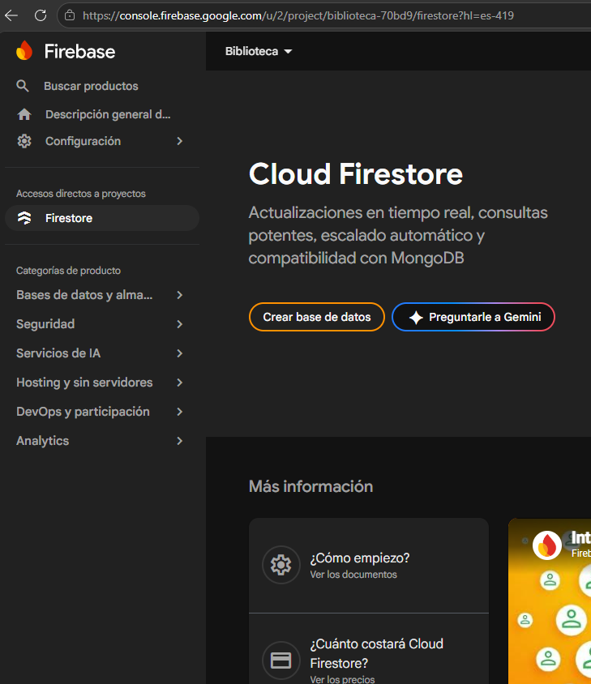
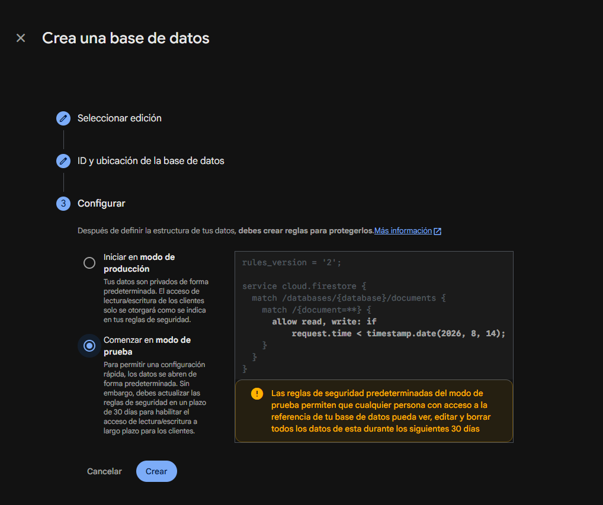
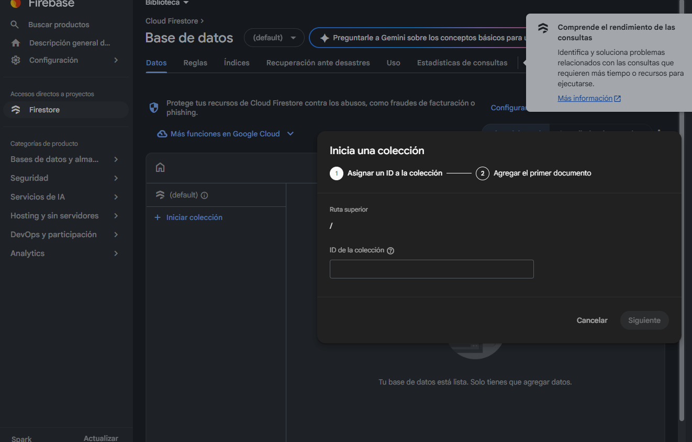
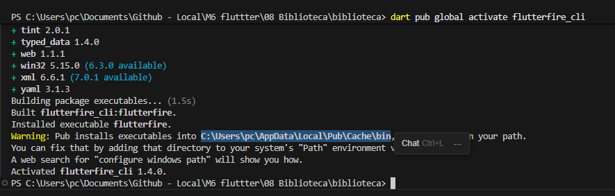
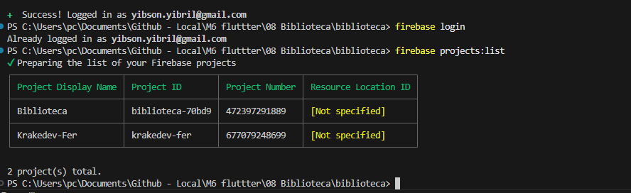

# biblioteca

A new Flutter project.

## Dependencias

```
dependencies:
  flutter:
    sdk: flutter
  firebase_core: ^4.12.1
  cloud_firestore: ^6.7.1
```

## Conectar y crear en Firebase

### 1. Crear proyecto en Firebase Console

Crear un proyecto en [Firebase Console](https://console.firebase.google.com/).





### 2. Instalar Firebase CLI y FlutterFire CLI

Seguir la documentación oficial: https://firebase.flutter.dev/docs/overview/

```bash
# Instalar Firebase CLI
npm install -g firebase-tools

# Login en Firebase
firebase login

# Instalar FlutterFire CLI
dart pub global activate flutterfire_cli
```

**Importante:** Agregar la ruta del Pub Cache al PATH del sistema:


En este caso: `C:\Users\pc\AppData\Local\Pub\Cache\bin`

### 3. Configurar FlutterFire

Cerrar y abrir el IDE después de instalar las herramientas.

```bash
flutterfire configure --project=biblioteca-70bd9
```

Esto genera automáticamente el archivo `lib/firebase_options.dart` y configura `google-services.json` para Android.

Verificar autenticación:
```bash
firebase login:list
firebase projects:list
```


### 4. Inicializar Firebase en main.dart

```dart
import 'package:firebase_core/firebase_core.dart';
import 'package:flutter/material.dart';
import 'firebase_options.dart';

void main() async {
  WidgetsFlutterBinding.ensureInitialized();
  await Firebase.initializeApp(
    options: DefaultFirebaseOptions.currentPlatform,
  );
  runApp(const MainApp());
}
```
